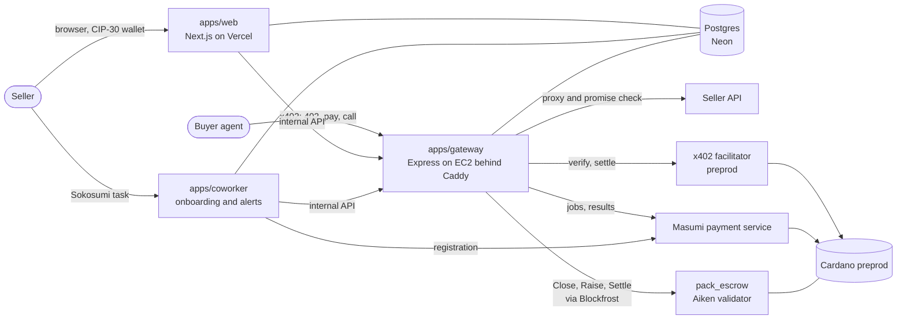

<p align="center"></p>

# Hirakumi

Make your APIs monetizable for AI agents. A seller lists any read-only API, proves they own it, and approves a promise that every good answer must keep. Buyer agents pay once for a pack of calls with x402 on Cardano, and a call uses a credit only when its answer passes the promise. Large or risky packs settle through an Aiken escrow contract that pays the seller only for calls the buyer signed for. Every listing is also a Masumi agent that other agents can hire per job through Masumi escrow.

Built for TOKEN2049 Origins, Cardano "Agentic Commerce" track. Cardano preprod only.

## Live

| What | URL |
|---|---|
| Web app (seller dashboard, public pages) | https://hirakumi.vercel.app |
| Try a live API in the browser (real preprod credits) | https://hirakumi.vercel.app/p/api_eejiaioyqt/try |
| Gateway (x402 packs, paid calls, MIP-003) | https://52-70-235-103.sslip.io |
| Demo seller: crypto prices (`sellers/price-api`) | https://price.52-70-235-103.sslip.io/openapi.json |
| Demo seller: Mika's FX Rates (`sellers/fx-api`, the fresh listing in the demo) | https://mika.52-70-235-103.sslip.io/openapi.json |
| A listed API as a Masumi agent (MIP-003) | https://52-70-235-103.sslip.io/a/api_eejiaioyqt/availability |

Submission material: [write-up](docs/submission/writeup.md), [demo script](docs/submission/demo-script.md), [slides outline](docs/submission/slides-outline.md), [submission checklist with all on-chain evidence](docs/submission/submission-checklist.md).

## How it works

### Seller
1. **Bring the API.** Paste an OpenAPI link, or give a base URL and a few example requests, one per line (`GET /rate?from=USD&to=EUR`, `GET /coins/{id=cardano}?days?=7`, `POST /search {"q":"ada"}`). Hirakumi turns example requests into an OpenAPI 3.1 file (`packages/core/src/samples.ts`). This works on the website or from a Sokosumi task assigned to the Hirakumi coworker.
2. **Choose endpoints.** Only read-only endpoints are sold. For POST, PUT, PATCH and DELETE the seller confirms the endpoint is read-only; Hirakumi cannot prove it.
3. **Prove ownership.** The seller adds one DNS TXT record: name `_hirakumi.<host>`, value the API's own code (`hkv_...`). The API itself doesn't change, so this works the same on any platform or framework. The gateway looks the record up through public resolvers (`DNS_RESOLVERS`, default 1.1.1.1 and 8.8.8.8) and never calls the API to do it. The ownership page reads the domain's nameservers to name its DNS provider (Cloudflare, Vercel, Route 53, GoDaddy, Namecheap, Porkbun and others) and gives that provider's steps and the exact Name to type. It warns when the host is on a platform's shared domain (`*.vercel.app`, `*.herokuapp.com`, from the Public Suffix List), where the seller can't add records. "Ask Hirakumi how" opens the help chat, which knows the seller's own record. One CIP-30 wallet signature then binds the API to the seller's payout address.
4. **Test calls and the promise.** Hirakumi calls the API with the example inputs and infers a promise from the real answers. JSON answers are checked against a JSON Schema with a freshness keyword (`maxAgeSeconds`). Text answers (CSV, XML, plain text, YAML) are checked for a 2xx status, the media type, a non-empty body, no HTML error page, and a required phrase that the seller confirms before publishing. Hirakumi suggests a phrase that every good test answer has and the answer to a wrong request lacks.
5. **Price and publish.** The default is 100 calls for 2 tUSDM. The listing is registered on the Masumi registry and goes Live.
6. **Stay honest.** A monitor re-runs the saved test inputs against the full promise (every 2 minutes; every 10 seconds in demo mode). After repeated failures the API is Down: MIP-003 `/availability` answers 503 (the registry shows it Offline), paid routes answer 503 before anyone pays, and the seller gets a Sokosumi comment. Every 6 hours (with jitter) the gateway looks the `_hirakumi` TXT record up again; two misses in a row pause new sales until it is back, while credits already bought keep working. A DNS timeout or server failure neither counts nor resets. APIs proven before the DNS proof (by the old `X-Hirakumi-Verify` response header) keep being re-checked by that header.

APIs that need a key: the seller saves it as a header (recommended) or a query parameter. The web app seals it with the gateway's X25519 public key, bound to the API's id, origin, path and placement, so only the gateway can open it, and only for calls inside the proven origin and folder.

### The front door: only reachable through Hirakumi

A monetized API should not also be free at its own address. With the front door, the seller's public hostname (`api.seller.com`) points at Hirakumi and the gateway answers it by `Host`; the gateway calls the seller's server at a second hostname (`origin.seller.com`) with the seller's key. The page is **Protect your API** (`/apis/<id>/protect`, linked from the overview and the review step):

1. The seller serves the same API at a second hostname that only answers with their key, and adds `_hirakumi.<origin host>` with the same `hkv_` code they proved ownership with. Origins on a platform's shared domain are refused.
2. **Test and switch:** the gateway checks the TXT record at both hostnames, opens the key (sealed for the new origin) and makes one test call per endpoint there. Only when all pass does it switch `apis.origin` and the key, and the old hostname becomes a `pending_dns` front-door domain (`api_domains`, migration `0020_front_door.sql`).
3. The seller points the hostname at Hirakumi: `CNAME api.seller.com -> 52-70-235-103.sslip.io` (an apex gets `A 52.70.235.103`). The page warns to lower the TTL first, remove AAAA records, use Cloudflare's DNS only (grey cloud), and that the whole hostname moves.
4. **Check connection:** every A and AAAA record (after any CNAME) must be in `EDGE_IPS`, then one HTTPS request to the hostname must come back from the front door. The domain is then `active`.

On the front door, an operation's public path is `path_prefix + op.path`, as in the seller's own docs. Path parameters, the query and a JSON body (`body`) become the call's input, and the call runs through the same code as `/a/<apiId>/x/<opId>` (`handlePaidCall`). A caller without a pack token, or with the seller's old key, gets the 402 with `message: "This API is only available through Hirakumi. Buy a pack of calls: <buyUrl>"`, `listingUrl` (`WEB_BASE_URL/p/<apiId>`), `gatewayUrl`, a `Link: <listingUrl>; rel="payment"` header and `cache-control: no-store`. Unknown, detached or disabled hostnames answer 421; a seller's hostname never reaches `/internal`, `/a` or `/healthz`. Every upstream call carries `x-hirakumi-hop: 1` and the front door answers 508 to it, and no origin may resolve to `EDGE_IPS`.

Caddy gets certificates for front-door hostnames on demand (`on_demand_tls` in the `Caddyfile`), asking the gateway's TLS ask listener (`GET http://gateway:4022/tls-ask?domain=`, compose `expose` only) first. It says yes only for a `pending_dns` or `active` hostname whose TXT record was verified, from the database (cached 60 s), with no live DNS. An account can use the front door on 3 hostnames, and at most 20 new ones are set up per hour across Hirakumi. Every 6 hours (with jitter) the monitor checks each hostname again: two TXT misses in a row disable it (421, no certificate), two checks that find it pointing elsewhere detach it. DNS timeouts neither count nor reset. None of this stops sales at Hirakumi's own URL. "Stop using the front door" detaches the hostname at once.

Removing an API from Hirakumi (retire or delete) removes the whole layer: sales stop, the key is dropped, and the front door is detached. The dialog lists, and a chat message keeps, what the seller undoes on their side: point the hostname back at their own server, and remove the key check if they want direct callers again.

### Buyer
1. The agent calls an endpoint and gets HTTP 402 with the pack offers, the price, the promise hash (the rule is readable at `GET /r/<ruleHash>`) and the settlement mode in `extra.settlement`.
2. It pays once with x402 (`exact` scheme, tUSDM) and gets a credit token.
3. Each call is plain HTTP with that token. The gateway reserves one credit atomically, calls the seller and checks the answer. Pass: 200 and the credit is used. Fail: 422 with the failing checks, and the credit is returned.
4. Every call is logged with its verdict, rule hash and input and output hashes, readable by the token holder at `GET /a/<apiId>/receipts`.

### Settlement: direct or escrow, chosen per purchase
With `PACK_MODE=hybrid` (the default) a pure policy (`packages/core/src/settlement.ts`) picks per purchase and says why in `extra.settlement.reasons`:

- **Escrow** for a pack of 2 tUSDM or more, a seller under 99% uptime over 7 days, a listing younger than 7 days, or a buyer that sends `X-Hirakumi-Settlement: escrow` (the buyer agent does this with `REQUIRE_ESCROW=1`). A buyer that demands escrow gets escrow or a 503, never a quiet direct offer.
- **Direct** otherwise, or when the buyer sends no IOU key and refund address.

Why both: direct is one transaction straight to the seller, about 0.014 ADA of overhead per call at 100 calls instead of about 1.4 ADA if every call paid on chain, but the buyer trusts Hirakumi's credit count. Escrow adds a Close and a Settle transaction, but the money sits in a contract and the seller can only be paid for calls the buyer signed for.

| | Escrow pack | Direct pack | Masumi escrow job |
|---|---|---|---|
| Where the money sits | `pack_escrow` contract until settlement | Seller's wallet from purchase | Masumi contract per job |
| What the seller can be paid | Calls the buyer signed IOUs for | The whole pack up front | The job, if a passing result is submitted |
| Who counts | Buyer-signed cumulative IOUs, checked on chain | Hirakumi's database (auditable at `/receipts`) | Nothing to count |
| If Hirakumi disappears | Buyer closes with 0 and gets everything back | Remaining credits can't be used | No result, so Masumi refunds |

The escrow contract (`contracts/pack-escrow`, Aiken, Plutus V3, 175 tests): the x402 payment locks the pack at the script with an inline datum (buyer refund address, seller, price per call, IOU public key, closer, contest period, fee). The buyer agent checks each answer itself and signs an ed25519 IOU over `"HKR1" || channel_id || count` only for passes. `Close` proposes a count (a count of 0 needs no signature, so the buyer can always exit), `Raise` lets anyone holding a higher signed IOU raise it during the contest window, and `Settle` pays the seller `count x price - fee`, Hirakumi the fee (3%) and the buyer the rest, with payouts summed per address so one output cannot be counted twice. The gateway publishes the latest IOU on a public channel page and runs a watcher that raises stale closes and settles.

## Cardano and Masumi: where in the code

| Technology | Used for | Code |
|---|---|---|
| x402 on Cardano (`@x402/*` pinned to 2.26.0, `cardano:preprod`, hosted preprod facilitator) | Pack purchase route, `exact` scheme, tUSDM, `payTo` = seller or script; credit token activated only in `onAfterSettle` | `apps/gateway/src/packs.ts` |
| x402 client | Buyer agent: `wrapFetchWithPayment`, `toClientCardanoSigner`, spend limits, offer and datum checks | `agents/buyer/src/payClient.ts`, `agents/buyer/src/escrowPackFlow.ts` |
| Aiken smart contract (Plutus V3, EUTXO, inline datum) | Pack escrow: lock, Close, Raise, Settle | `contracts/pack-escrow/validators/pack_escrow.ak`, `contracts/pack-escrow/lib/hirakumi/` |
| Off-chain escrow (Evolution SDK, Blockfrost) | Datum encoding, IOUs, payouts, transaction building, lock verification; gateway watcher | `packages/escrow/src/`, `apps/gateway/src/escrowPacks.ts`, `apps/gateway/src/channelWatcher.ts` |
| Native tokens | tUSDM for packs (`USDM_PREPROD_ASSET`), Masumi tUSDM for jobs, a Masumi registry token per listing | `apps/gateway/src/packs.ts`, `apps/gateway/src/config.ts`, `packages/masumi/src/registry.ts` |
| Masumi payment service 0.29 (self-hosted) | Registry registration, payment requests, result submission, purchases | `packages/masumi/src/`, `apps/coworker/src/onboarding/registerStep.ts`, `docker-compose.yml` |
| Masumi MIP-003 and MIP-004 | `start_job`, `status`, `availability`, `input_schema`; input and output hashes | `apps/gateway/src/mip003.ts`, `apps/gateway/src/jobs.ts`, `packages/core/src/hashing.ts` |
| Sokosumi | Seller coworker: onboarding by task comments, health alerts | `apps/coworker/src/sokosumi/`, `apps/coworker/src/alerts.ts` |
| CIP-30 wallets (Lace, Eternl and others) | Login and ownership signature | `apps/web/app/api/auth/`, `apps/web/app/api/apis/[apiId]/ownership/` |

## Architecture



## On-chain evidence (Cardano preprod)

Every transaction, with context, is in [submission-checklist.md](docs/submission/submission-checklist.md).

| What | Transaction |
|---|---|
| Hybrid on the production gateway, buyer demands escrow: lock | [8b648494...](https://preprod.cardanoscan.io/transaction/8b6484943561dad5f8a297e07fb217c5ee009e018c9c618ad711691bbd775032) |
| Same channel: Close at 3 signed calls | [2d296403...](https://preprod.cardanoscan.io/transaction/2d29640399bd266b9e2a7bfcd5d382443b97fd0a884b987e5997f3989136d4e4) |
| Same channel: Settle (seller 0.0582, Hirakumi 0.0018, buyer refund 1.94 tUSDM) | [cad54fc0...](https://preprod.cardanoscan.io/transaction/cad54fc01cdd98f04e94f32113f5d3368f462c734beb37d66fee54980180093d) |
| Hybrid, direct chosen ("small pack, proven seller"): 1 tUSDM to the seller | [200a86c0...](https://preprod.cardanoscan.io/transaction/200a86c03d0936de6f15f37f09e7931ca3fad96ce20b22728d9c731bf3975e7b) |
| Escrow: Close at 1, Raise to 3, Settle | [Raise dc051596...](https://preprod.cardanoscan.io/transaction/dc051596cf21c7c5dececb29c3fbb914c3d945b4a308c40fc141ac92bf78bfdb), [Settle 6ba1bf17...](https://preprod.cardanoscan.io/transaction/6ba1bf17c9976f876bcc0295ae523f8c1f2c2051ade0bf283e83b4843d4eaf37) |
| Escrow, buyer exits with no IOU: Settle returns everything | [f33c1788...](https://preprod.cardanoscan.io/transaction/f33c1788c36afdd09fee5204fe35ed1102a2fe117e3a87fa08092211f8dbb6ea) |
| First direct x402 pack, 2 tUSDM to the seller | [43844e7b...](https://preprod.cardanoscan.io/transaction/43844e7b86c35e680805d5916cd38743462fbcf4cbd1db580d0faad8936e6a09) |
| Masumi registry registration (mint) | [4a1b77aa...](https://preprod.cardanoscan.io/transaction/4a1b77aa7ae49df15e10ade1e920bd22c7d5b3ed204e21e9a5742e00cdf5cac2) |
| Masumi job kept its promise: result submitted, seller collected | [f60d247d...](https://preprod.cardanoscan.io/transaction/f60d247d30e075f69cd5b876c49df45a4aadf68fa7fc67d0a00c60edb2321fd2), [6fd28bb9...](https://preprod.cardanoscan.io/transaction/6fd28bb92094e8fd5e9332d644c8fd7fd6f2c4572847ded32bcb22df9a46ae4a) |
| Masumi job broke its promise (stale data): no result, refund | [8487fcc1...](https://preprod.cardanoscan.io/transaction/8487fcc1ea74df73a170c937215a59ee2b16f2be418ccd879f67b4bf38b5d9c0) |

Escrow script address: [`addr_test1wq3a6jmeshhdn8wnzgrgtxzgsz26w8ggnupzty69sa2lwqs3jsjn3`](https://preprod.cardanoscan.io/address/addr_test1wq3a6jmeshhdn8wnzgrgtxzgsz26w8ggnupzty69sa2lwqs3jsjn3).

## Repository layout

| Path | What |
|---|---|
| `apps/gateway` | Express gateway: x402 packs, credits, promise checks, escrow channels and watcher, MIP-003, health monitor, ownership re-check |
| `apps/web` | Next.js app: seller onboarding, ownership, review and publish, public status and try pages |
| `apps/coworker` | Sokosumi coworker: onboarding steps (parse, describe, test calls, register) and health alerts |
| `packages/core` | Shared logic: promise rules and hashes, SSRF-safe fetch, example requests to OpenAPI, settlement policy, sealed seller keys |
| `packages/db` | Postgres access and the migration runner for `db/migrations` |
| `packages/escrow` | Off-chain side of the pack escrow: datum, IOUs, payouts, transactions |
| `packages/masumi` | Masumi payment service and registry client, plus preprod end-to-end scripts |
| `contracts/pack-escrow` | Aiken validator and its tests |
| `agents/buyer` | Buyer agent CLIs: `pack` (x402 pack, direct or escrow) and `escrow` (one Masumi job) |
| `sellers/price-api`, `sellers/fx-api` | Demo seller APIs with a break switch |
| `scripts/escrow-run` | Standalone preprod run of the escrow contract (lock, Close, Raise, Settle) |
| `deploy/`, `docker-compose.yml`, `Caddyfile` | EC2 deployment |
| `docs/submission`, `docs/brand` | Hackathon submission material and logos |

## Run locally

Requirements: Node 22+, pnpm 10, Docker, a Blockfrost preprod key, and a funded preprod wallet (tADA from https://docs.cardano.org/cardano-testnets/tools/faucet, tUSDM from https://tusdm.moneta.global).

```bash
pnpm install
cp .env.example .env                                   # fill in; every variable is commented
pnpm db:up                                             # local Postgres on :5432
pnpm --filter @hirakumi/gateway upstream-auth-keys     # key pair for sealed seller API keys
pnpm --filter @hirakumi/gateway dev                    # gateway on :4021, applies migrations at boot
pnpm --filter @hirakumi/web dev                        # web on :3000 (put its variables in apps/web/.env.local)
pnpm --filter @hirakumi/price-api dev                  # demo seller on :4100
pnpm --filter @hirakumi/buyer run pack -- --api <apiId> --calls 10     # buy a pack and call it
pnpm --filter @hirakumi/buyer run escrow -- --api <apiId>              # one Masumi escrow job
```

`pack` takes `--op <opId>` and `--query name=value` for other APIs. Listing by example requests (no OpenAPI file) is on when the web has `SAMPLES_INTAKE=1`.

Break the demo seller to see a 422 and the Down state:
```bash
curl -XPOST $PRICE_API_URL/admin/break -H "Authorization: Bearer $ADMIN_TOKEN" \
  -H 'content-type: application/json' -d '{"mode":"empty"}'     # or "stale", "ok"
```

## Test

```bash
pnpm db:up
pnpm typecheck
pnpm test                                    # every workspace; database tests use TEST_DATABASE_URL
cd contracts/pack-escrow && aiken check      # 175 contract tests
```

## Deploy

- **Gateway, coworker, Masumi payment service, demo sellers:** one EC2 host, `docker compose up -d` (`docker-compose.yml`, `deploy/app.Dockerfile`). Caddy serves HTTPS for `$PUBLIC_DOMAIN`, `price.$PUBLIC_DOMAIN` and `mika.$PUBLIC_DOMAIN`, and for front-door hostnames on demand (the catch-all `https://` site, asking the gateway on port 4022 first). Gateway settings for the front door: `EDGE_IPS` (the host's public addresses, default `52.70.235.103`), `WEB_BASE_URL` (for `listingUrl` in the front door's 402) and `TLS_ASK_PORT` (default 4022). The payment service uses the local Postgres; Hirakumi's data is in Neon (`DATABASE_URL`). The gateway applies migrations at boot. Payment-service settings go in `deploy/masumi.env` (template: `deploy/masumi.env.example`).
- **Web:** Vercel, root `apps/web`, with `DATABASE_URL`, `SESSION_SECRET`, `INTERNAL_TOKEN`, `PUBLIC_BASE_URL`, `WEB_BASE_URL` and `UPSTREAM_AUTH_PUBLIC_KEY`.
- **Scaling:** a paid call is one indexed lookup and one atomic update in Postgres, with nothing on chain per call. The gateway keeps no per-call state outside Postgres except health counters, so it runs as several instances once those move to Postgres or Redis. One payment-service node serves many sellers.

## Security model and known limits

- **Who checks:** the pass or fail check runs on Hirakumi's gateway, against a rule whose hash is in the 402 before payment. In escrow the buyer agent re-checks every answer and signs only passes, so the seller cannot be paid for a call the buyer rejected. In direct mode the buyer trusts Hirakumi's count; receipts make it auditable but the chain does not refund a wrong charge.
- **Ownership:** the header code proves control of the base URL's folder and below; the wallet signature binds the payout address; the header is re-checked every 6 hours.
- **Seller keys:** sealed for the gateway only, never shown again, refused if found in the example requests or the OpenAPI file, and an answer that contains the key is withheld. That leak check covers common encodings, not every possible one, so a header key is preferred over a query key.
- **Outbound calls:** every call to a seller API goes through `packages/core/src/fetch.ts`, which refuses private and reserved addresses and Hirakumi's own `EDGE_IPS` at connect time, follows no redirects, and caps time and size.
- **Front door:** the `Host` header only selects a public listing; no URL, redirect or cache key is built from it, and a seller's hostname never reaches internal routes. A certificate needs a verified TXT record and is capped per account and per hour. Because certificate transparency logs reveal the origin hostname, the front door requires the seller's key. A hostname counts as routed only when every A and AAAA record is Hirakumi's.
- **`start_job`:** MIP-003 defines no authentication, so it is rate limited per client address (10 per minute; `START_JOB_TRUSTED_CIDRS` raises it for Sokosumi's backend).
- **Limits:** preprod only; read-only is the seller's word for non-GET endpoints; binary answers are not supported; the escrow contract is not audited; a promise checks shape, freshness and a phrase, not whether a value is true.

## License

MIT
