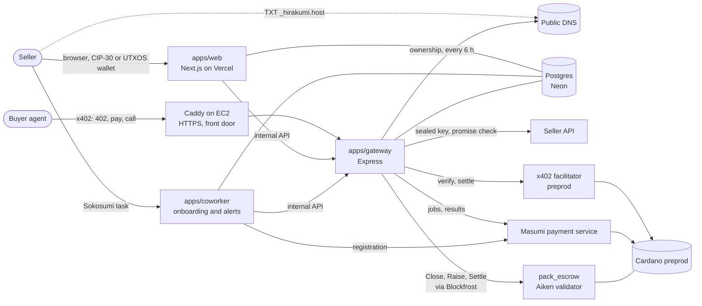

<p align="center"></p>

# Hirakumi

**Monetize any API in under 3 minutes.**

**You set a promise. AI agents pay only when you keep it.**

Hirakumi makes an existing API payable by AI agents from one link, with no change to the seller's code. Sign in with Google or email (UTXOS) or start from a Sokosumi task, prove ownership with one DNS record, and Hirakumi registers the API as an agent on Masumi. Agents pay once with x402 on Cardano for a pack of 100 answers; the gateway checks every answer against a public promise, so only good answers are paid for. Large packs wait in an Aiken smart contract that pays the seller only for answers the agent signed as good.

Built for TOKEN2049 Origins, Cardano "Agentic Commerce" track. Live on Cardano preprod.

## Live

| What | URL |
|---|---|
| Web app (seller dashboard, public pages) | https://hirakumi.vercel.app |
| Buy a real pack in your browser (preprod credits) | https://hirakumi.vercel.app/p/api_eejiaioyqt/try |
| Showcase listing: Mika's FX Rates | https://hirakumi.vercel.app/p/api_7ebwqwczcw |
| Gateway (x402 packs, paid calls, MIP-003) | https://52-70-235-103.sslip.io/healthz |
| A listed API as a Masumi agent (MIP-003) | https://52-70-235-103.sslip.io/a/api_eejiaioyqt/availability |
| Demo seller: crypto prices (`sellers/price-api`) | https://price.52-70-235-103.sslip.io/openapi.json |
| Demo seller: Mika's FX Rates (`sellers/fx-api`) | https://mika.52-70-235-103.sslip.io/openapi.json |
| Demo seller: Clean Air (`sellers/air-api`) | https://air.patricksteveharrison.com/openapi.json |

Submission material: [write-up](docs/submission/writeup.md) and [submission evidence](docs/submission/submission-checklist.md).

## The problem

Enterprises and institutions sit on lots of good APIs. Making one payable by AI agents means new code inside big, siloed codebases: billing, wallets, refunds and an agent wrapper, each change waiting on security review and the next release. The average enterprise runs 897 applications with only 29% connected, and IT spends 39% of its time on custom integrations (MuleSoft, 2025). So most of these APIs never earn a cent from agents.

Even on Masumi, Cardano's marketplace for AI agents, buyers have no trust layer: they pay even for empty or stale answers, because the seller grades its own work. An AI can write you an agent, but it can't be its own trust layer.

Hirakumi needs no change to the seller's code: one DNS record proves ownership, the API stays as it is, and the payments, the trust layer and the Masumi listing are added around it. It isn't only for enterprises: any developer with an API can make it ready to earn from agents within minutes.

## How it works

### Seller: from API to Masumi agent

1. **Bring any API.** Paste an OpenAPI link, or a base URL and a few example requests, one per line (`GET /rate?from=USD&to=EUR`, `GET /coins/{id=cardano}?days?=7`, `POST /search {"q":"ada"}`). Hirakumi turns them into an OpenAPI 3.1 file (`packages/core/src/samples.ts`) and describes each endpoint. Only read-only endpoints are sold; for POST, PUT, PATCH and DELETE the seller confirms the endpoint is read-only.
2. **Prove it's yours.** One DNS TXT record: name `_hirakumi.<host>`, value the API's own code (`hkv_...`). The API itself doesn't change, so this works on any platform. The gateway reads the record through public resolvers and never calls the API to do it. The ownership page detects the seller's DNS provider (Cloudflare, Vercel, Route 53, GoDaddy, Namecheap, Porkbun and others) and gives that provider's exact steps. One wallet signature then binds the API to the seller's payout address: a CIP-30 browser wallet (Lace, Eternl and others), or, with UTXOS, an email or Google login that opens a non-custodial wallet the seller owns.
3. **Seal the key.** If the API needs a key, the web app seals it with the gateway's X25519 public key, bound to the API's id, origin, path and placement. Only the gateway can open it, and only for calls inside the proven origin.
4. **Set the promise.** Hirakumi calls the API with the example inputs and infers a promise from the real answers. JSON answers are checked against a JSON Schema with a freshness keyword (`maxAgeSeconds`). Text answers (CSV, XML, plain text, YAML) are checked for a 2xx status, the media type, a non-empty body, no HTML error page, and a required phrase the seller confirms. The promise's hash is public before any sale.
5. **Publish.** The listing is registered on the Masumi registry with its own registry token and sold in packs of 100 calls (default 2 tUSDM).
6. **Stay honest.** A monitor re-runs the saved test inputs against the full promise every 2 minutes (every 10 seconds in demo mode). After repeated failures the API is Down: MIP-003 `/availability` answers 503 (the registry shows it Offline), paid routes answer 503 before anyone pays, and the seller gets a Sokosumi comment. Every 6 hours the gateway looks the `_hirakumi` record up again; two misses in a row pause new sales until it is back, while credits already bought keep working.

### The front door: the paid API isn't free elsewhere

With the front door, the seller's public hostname (`api.seller.com`) points at Hirakumi, and Caddy and the gateway answer it. The gateway calls the seller's server at a second hostname (`origin.seller.com`) with the sealed key. The seller sets it up on **Protect your API** (`/apis/<id>/protect`):

1. Serve the same API at a second hostname that only answers with the key, and add `_hirakumi.<origin host>` with the same code.
2. **Test and switch:** the gateway checks the TXT record at both hostnames and makes one test call per endpoint at the new origin. Only when all pass does it switch.
3. Point the hostname at Hirakumi: `CNAME api.seller.com -> 52-70-235-103.sslip.io` (an apex gets `A 52.70.235.103`).
4. **Check connection:** every A and AAAA record must be Hirakumi's, and one HTTPS request must come back from the front door. The hostname is then active.

On the front door, an endpoint keeps the path from the seller's own docs. A caller without a pack token, or with the seller's old key, gets a 402 that says "This API is only available through Hirakumi" with a link to buy a pack. Caddy issues certificates on demand (`on_demand_tls` in the `Caddyfile`), only for hostnames whose TXT record the gateway verified. Every 6 hours the monitor checks each hostname again.

### Buyer: pay once, then only for good answers

1. **See the offer.** The agent calls an endpoint and gets HTTP 402 with the pack price, the promise hash (the promise is readable at `GET /r/<ruleHash>`) and the settlement mode in `extra.settlement`.
2. **Pay once.** One x402 payment on Cardano (`exact` scheme, tUSDM) buys 100 calls, direct or into escrow, and returns a credit token.
3. **Ask.** Each call is plain HTTP with that token. The gateway reserves one credit atomically, calls the seller with the sealed key and checks the answer against the promise.
   - Promise kept: 200, one credit used.
   - Promise broken: 422 with the failing checks, nothing charged.
4. **Audit.** Every call is logged with its verdict, promise hash and input and output hashes, readable by the token holder at `GET /a/<apiId>/receipts`.

### Hybrid settlement: direct or escrow, chosen per purchase

With `PACK_MODE=hybrid` (the default) a pure policy (`packages/core/src/settlement.ts`) picks per purchase and says why in `extra.settlement.reasons`:

- **Escrow** for a pack of 2 tUSDM or more, a seller under 99% uptime over 7 days, a listing younger than 7 days, or a buyer that sends `X-Hirakumi-Settlement: escrow`. A buyer that asks for escrow gets escrow or a 503, never a silent switch to direct.
- **Direct** for small packs from proven sellers: one transaction straight to the seller.

| | Escrow pack | Direct pack | Masumi escrow job |
|---|---|---|---|
| Where the money sits | `pack_escrow` contract until settlement | Seller's wallet from purchase | Masumi contract per job |
| What the seller is paid | Answers the buyer signed receipts for | The whole pack up front | The job, when a passing result is submitted |
| Who counts | Buyer-signed cumulative receipts, checked on chain | Hirakumi's gateway, auditable at `/receipts` | One job, one result |
| If Hirakumi disappeared | The buyer closes with 0 and gets everything back | Remaining credits need the gateway | No result, so Masumi refunds |

**The safe** (`contracts/pack-escrow`, Aiken, Plutus V3, 175 tests): the x402 payment locks the pack at the script with an inline datum (buyer refund address, seller, price per call, receipt key, closer, contest period, fee). The buyer agent checks each answer itself and signs an ed25519 receipt over `"HKR1" || channel_id || count` only for good answers. `Close` proposes a count (a count of 0 needs no signature, so the buyer can always exit), `Raise` lets anyone holding a higher signed receipt raise it during the contest window, and `Settle` pays the seller `count x price - fee`, Hirakumi the 3% fee and the buyer the rest. Nobody can take more than the agent agreed to, not even Hirakumi. The gateway publishes the latest receipt on a public channel page and runs a watcher that raises stale closes and settles.

## Why not just ask an AI to build it?

An AI can write you an agent, but it can't be its own trust layer.

| | Agent written by an AI assistant | Hirakumi |
|---|---|---|
| Who judges an answer | The seller's own code | A neutral gateway checks every answer against the public promise |
| Health status | Whatever the seller says | Hirakumi re-runs the test calls and marks a broken API Down |
| Ownership | Not checked | A DNS TXT record and a wallet signature, re-checked every 6 hours |
| Payment cost | One on-chain payment per job, about 40 cents | One x402 payment for 100 answers |
| Buyer protection | Masumi refund per job | Also the safe: the seller is paid only for answers the buyer signed for |
| What the seller runs | A new service to host | Nothing new; the existing API is unchanged |

## Built on Cardano's tools for AI agents

| Tool | Used for | Code |
|---|---|---|
| x402 on Cardano (`@x402/*` 2.26.0, `cardano:preprod`, hosted preprod facilitator) | Pack purchase route, `exact` scheme, tUSDM, `payTo` the seller or the script; the credit token activates only after settlement (`onAfterSettle`) | `apps/gateway/src/packs.ts` |
| x402 client | Buyer agent: `wrapFetchWithPayment`, spend limits, offer and datum checks | `agents/buyer/src/payClient.ts`, `agents/buyer/src/escrowPackFlow.ts` |
| Masumi directory (payment service 0.29, self-hosted) | Registry registration, payment requests, result submission | `packages/masumi/src/`, `apps/coworker/src/onboarding/registerStep.ts`, `docker-compose.yml` |
| Masumi MIP-003 and MIP-004 | `start_job`, `status`, `availability`, `input_schema`; input and output hashes | `apps/gateway/src/mip003.ts`, `apps/gateway/src/jobs.ts`, `packages/core/src/hashing.ts` |
| Sokosumi coworker | Onboarding from a Sokosumi task, health alerts | `apps/coworker/src/sokosumi/`, `apps/coworker/src/onboarding/`, `apps/coworker/src/alerts.ts` |
| Aiken contract (Plutus V3, inline datum) | The safe: lock, Close, Raise, Settle | `contracts/pack-escrow/validators/pack_escrow.ak`, `contracts/pack-escrow/lib/hirakumi/` |
| Evolution SDK and Blockfrost | Datum encoding, receipts, payouts, transaction building, lock verification, the channel watcher | `packages/escrow/src/`, `apps/gateway/src/escrowPacks.ts`, `apps/gateway/src/channelWatcher.ts` |
| Native tokens | tUSDM for packs, Masumi tUSDM for jobs, a Masumi registry token per listing | `apps/gateway/src/config.ts`, `packages/masumi/src/registry.ts` |
| UTXOS sign-in | "Continue with email or Google": a non-custodial Cardano wallet for sign-in, ownership signing and payment | `apps/web/lib/utxos-wallet.ts`, `apps/web/lib/wallet-client.ts` |
| CIP-30 wallets (Lace, Eternl and others) | Sign-in and the ownership signature | `apps/web/app/api/auth/`, `apps/web/app/api/apis/[apiId]/ownership/` |
| DNS ownership (re-checked every 6 h) | `_hirakumi` TXT record through public resolvers, DNS provider steps | `packages/core/src/dnsVerify.ts`, `apps/gateway/src/ownership.ts`, `apps/gateway/src/monitor.ts`, `apps/web/lib/dns-provider.ts` |
| Front door on Caddy | The seller's hostname answers through Hirakumi; on-demand certificates | `apps/gateway/src/frontDoor.ts`, `apps/gateway/src/frontDoorAdmin.ts`, `packages/db/src/frontDoor.ts`, `Caddyfile` |
| Sealed keys | X25519 sealing bound to the API, opened only by the gateway; leak check on every answer | `packages/core/src/upstreamAuth.ts`, `apps/web/lib/upstream-key.ts` |
| AWS and Vercel | Gateway, coworker, payment service and Caddy on EC2; web app on Vercel | `deploy/`, `docker-compose.yml`, `apps/web` |

## Economics

- **About 100x cheaper than paying for every call.** An on-chain payment per answer costs about 1.4 ADA (about 40 cents at 1 ADA = $0.28) and waits for a block. A pack spreads one payment over 100 answers: about 0.014 ADA (about 0.4 cents) per answer, and no wait per call.
- **Web speed.** Paid calls through the gateway returned in about 0.3 s on preprod. Direct packs settled on chain in 16.5 s and 9.4 s.
- **Revenue: a 3% fee** (`HIRAKUMI_FEE_BPS`, default 300), an output of the escrow contract, paid only on good answers, plus a small listing fee per API (planned).

## On-chain evidence (Cardano preprod)

### Showcase: Mika's FX Rates (`api_7ebwqwczcw`), the full lifecycle

A third-party API (`https://fx.patricksteveharrison.com`, key in the `X-API-Key` header) onboarded through the web app on 7 Oct 2026. Register, pay, calls, close, settle, with the seller paid on chain.

| Step | Evidence |
|---|---|
| 1. Register on Masumi (registry mint), 10:51 UTC | [8f04206b...](https://preprod.cardanoscan.io/transaction/8f04206b27e66266d61f22423c01447cad88582fb9c7fd7b96b7ac1f728e602a). Agent identifier [`67ab0c92...d436d11f5000000`](https://preprod.cardanoscan.io/token/67ab0c92c4ac1610895a1c965ee50aba41a8f1513b15240723b3bd0b10e52a7b4eff23a80d7da2d3ca490c28d7ea8eec153805b61d436d11f5000000); on-chain `api_base_url` `https://52-70-235-103.sslip.io/a/api_7ebwqwczcw` |
| MIP-003 agent | [`/availability`](https://52-70-235-103.sslip.io/a/api_7ebwqwczcw/availability) answers `available`, [`/input_schema`](https://52-70-235-103.sslip.io/a/api_7ebwqwczcw/input_schema) 200 |
| Promise | [`sha256:e05d0453...`](https://52-70-235-103.sslip.io/r/sha256:e05d0453a3c5b88266a67ccfdab4906219deea4d9439318ac1d91cd1043d5de0), the same hash is in the escrow datum |
| 2. Pay: 2 tUSDM for 100 calls into the safe ("large pack, new seller"), 10:52 UTC | Lock [07d1bc1d...](https://preprod.cardanoscan.io/transaction/07d1bc1d7f51dc41e17ea4bc179fe94f06e5524b51ce0de3f03321679728605b): 2 000 000 micros tUSDM at the escrow script; the inline datum names the seller (`addr_test1qzrz6vvv...dwlc45`) and the Hirakumi fee at 3% |
| 3. Calls | 3 paid calls to `convertAmount`, all kept the promise; the buyer signed receipts for 2 |
| 4. Close at 2 signed calls, 14:08 UTC | [faae6b22...](https://preprod.cardanoscan.io/transaction/faae6b22dca816fd91f8ed5d7a639db8f2c2d8325c5fa32457820aa3354cf6ac): proposes count 2 with the buyer's ed25519 receipt and starts the 3 minute contest window |
| 5. Settle, 14:13 UTC: **the seller is paid** | [d64f7906...](https://preprod.cardanoscan.io/transaction/d64f790605dbda025dbf92272c0546ea0fe02ab6f10984516df064da0fa4fdaa): **38 800 micros tUSDM to Mika's payout address** (2 signed calls x 0.02 tUSDM, less 3%), 1 200 to Hirakumi, 1 960 000 back to the buyer |

### More transactions

| What | Transaction |
|---|---|
| Hybrid on the production gateway, buyer asks for escrow: lock | [8b648494...](https://preprod.cardanoscan.io/transaction/8b6484943561dad5f8a297e07fb217c5ee009e018c9c618ad711691bbd775032) |
| Same channel: Close at 3 signed calls | [2d296403...](https://preprod.cardanoscan.io/transaction/2d29640399bd266b9e2a7bfcd5d382443b97fd0a884b987e5997f3989136d4e4) |
| Same channel: Settle (seller 0.0582, Hirakumi 0.0018, buyer refund 1.94 tUSDM) | [cad54fc0...](https://preprod.cardanoscan.io/transaction/cad54fc01cdd98f04e94f32113f5d3368f462c734beb37d66fee54980180093d) |
| Hybrid, direct chosen ("small pack, proven seller"): 1 tUSDM to the seller | [200a86c0...](https://preprod.cardanoscan.io/transaction/200a86c03d0936de6f15f37f09e7931ca3fad96ce20b22728d9c731bf3975e7b) |
| Escrow: Close at 1, Raise to 3, Settle | [Raise dc051596...](https://preprod.cardanoscan.io/transaction/dc051596cf21c7c5dececb29c3fbb914c3d945b4a308c40fc141ac92bf78bfdb), [Settle 6ba1bf17...](https://preprod.cardanoscan.io/transaction/6ba1bf17c9976f876bcc0295ae523f8c1f2c2051ade0bf283e83b4843d4eaf37) |
| Escrow, buyer exits with no receipt: Settle returns everything | [f33c1788...](https://preprod.cardanoscan.io/transaction/f33c1788c36afdd09fee5204fe35ed1102a2fe117e3a87fa08092211f8dbb6ea) |
| First direct x402 pack, 2 tUSDM to the seller (settled in 16.5 s) | [43844e7b...](https://preprod.cardanoscan.io/transaction/43844e7b86c35e680805d5916cd38743462fbcf4cbd1db580d0faad8936e6a09) |
| Direct pack paid straight to the API owner's wallet, 2 tUSDM (settled in 9.4 s) | [9d1b37be...](https://preprod.cardanoscan.io/transaction/9d1b37bee0227ae56217699b15ddea5cf7d549f2bd4dae0e734f304c55c7b9eb) |
| Masumi registry registration ("Live Crypto Prices", mint) | [4a1b77aa...](https://preprod.cardanoscan.io/transaction/4a1b77aa7ae49df15e10ade1e920bd22c7d5b3ed204e21e9a5742e00cdf5cac2) |
| Masumi job kept its promise: result submitted, seller collected 2 tUSDM | [f60d247d...](https://preprod.cardanoscan.io/transaction/f60d247d30e075f69cd5b876c49df45a4aadf68fa7fc67d0a00c60edb2321fd2), [6fd28bb9...](https://preprod.cardanoscan.io/transaction/6fd28bb92094e8fd5e9332d644c8fd7fd6f2c4572847ded32bcb22df9a46ae4a) |
| Masumi job broke its promise (stale data): no result, refund | [8487fcc1...](https://preprod.cardanoscan.io/transaction/8487fcc1ea74df73a170c937215a59ee2b16f2be418ccd879f67b4bf38b5d9c0) |
| Earlier Mika listing (`api_cke2nitg7f`): registry mint and an escrow pack lock | [4e6f7040...](https://preprod.cardanoscan.io/transaction/4e6f7040fade713187f29d52a68dfa6661ea3703de60201dc6bac71082c5dac0), [7119fc43...](https://preprod.cardanoscan.io/transaction/7119fc43e2a474f0d9930f80ce83a1b152fdc3ccf5feca12ea48f71213b9eb14) |

Escrow script address: [`addr_test1wq3a6jmeshhdn8wnzgrgtxzgsz26w8ggnupzty69sa2lwqs3jsjn3`](https://preprod.cardanoscan.io/address/addr_test1wq3a6jmeshhdn8wnzgrgtxzgsz26w8ggnupzty69sa2lwqs3jsjn3). Every requirement with its evidence: [submission evidence](docs/submission/submission-checklist.md).

## Sokosumi coworker: list an API without leaving Sokosumi

The Hirakumi coworker brings the whole onboarding into Sokosumi. A seller assigns it a task with an API link, and every step happens in the task's comments:

1. The coworker reads the API and lists the endpoints. The seller replies `sell 1 2`.
2. It posts the exact DNS record (Type, Name, Value), looks it up itself, and comments "Found your record".
3. It runs the test calls and writes the promise in plain words; a text promise takes its phrase as a reply (`phrase Price`).
4. It runs the leak check, takes the price (`price 2`), and registers the agent on Masumi once the seller has signed.
5. After publishing, the same task receives health alerts when the API goes Down.

Only a wallet signature or the API's key opens a browser tab, and each is one focused page with nothing else on it: "Sign to prove you own weather.example.com", "Add the key", "Sign to publish at 2 tUSDM for 100 calls". The link is one-time, bound to one API and one action, valid 30 minutes and stored only as a hash; the owner's wallet signature is the authority, so a forwarded link does nothing. The page ends with "Done. You can close this tab; the rest continues in Sokosumi." The first task links the Sokosumi account to a wallet the same way, and `link wallet` moves it to another wallet. Code: `apps/coworker/src/`, `apps/web/app/act/`.

## Architecture



## Repository layout

| Path | What |
|---|---|
| `apps/gateway` | Express gateway: x402 packs, credits, promise checks, escrow channels and watcher, MIP-003, health monitor, DNS ownership re-check, front door |
| `apps/web` | Next.js app: seller onboarding, ownership, review and publish, Protect your API, public status and try pages |
| `apps/coworker` | Sokosumi coworker: onboarding steps (parse, describe, test calls, register) and health alerts |
| `packages/core` | Shared logic: promise rules and hashes, SSRF-safe fetch, example requests to OpenAPI, DNS ownership, settlement policy, sealed seller keys |
| `packages/db` | Postgres access and the migration runner for `db/migrations` |
| `packages/escrow` | Off-chain side of the safe: datum, receipts, payouts, transactions |
| `packages/masumi` | Masumi payment service and registry client, plus preprod end-to-end scripts |
| `contracts/pack-escrow` | Aiken validator and its tests |
| `agents/buyer` | Buyer agent CLIs: `pack` (x402 pack, direct or escrow) and `escrow` (one Masumi job) |
| `sellers/price-api`, `sellers/fx-api`, `sellers/weather-api` | Demo seller APIs with a break switch |
| `stress` | Stress and abuse suite: money invariants, fuzzing, hostile sellers, load |
| `scripts/escrow-run` | Standalone preprod run of the escrow contract (lock, Close, Raise, Settle) |
| `deploy/`, `docker-compose.yml`, `Caddyfile` | EC2 deployment |
| `docs/submission`, `docs/brand` | Submission material and logos |

## Run locally

Requirements: Node 22+, pnpm 10, Docker, a Blockfrost preprod key, and a funded preprod wallet (tADA from https://docs.cardano.org/cardano-testnets/tools/faucet, tUSDM from https://tusdm.moneta.global).

```bash
pnpm install
cp .env.example .env                                   # fill in; every variable is commented
pnpm db:up                                             # local Postgres on :5432
pnpm --filter @hirakumi/gateway upstream-auth-keys     # key pair for sealed seller API keys
pnpm --filter @hirakumi/gateway dev                    # gateway on :4021, applies migrations at boot
pnpm --filter @hirakumi/web dev                        # web on :3000 (put its variables in apps/web/.env.local)
pnpm --filter @hirakumi/price-api dev                  # demo seller on :4100
pnpm --filter @hirakumi/buyer run pack -- --api <apiId> --calls 10     # buy a pack and call it
pnpm --filter @hirakumi/buyer run escrow -- --api <apiId>              # one Masumi escrow job
```

`pack` takes `--op <opId>` and `--query name=value` for other APIs. Listing by example requests (no OpenAPI file) is on when the web has `SAMPLES_INTAKE=1`.

Switch the demo seller to bad answers to see a 422 and the Down state:
```bash
curl -XPOST $PRICE_API_URL/admin/break -H "Authorization: Bearer $ADMIN_TOKEN" \
  -H 'content-type: application/json' -d '{"mode":"empty"}'     # or "stale", "ok"
```

## Test

```bash
pnpm db:up
pnpm typecheck
pnpm test                                    # every workspace; database tests use TEST_DATABASE_URL
cd contracts/pack-escrow && aiken check      # 175 contract tests
node stress/run.mjs                          # stress and abuse suite, see stress/README.md
```

## Deploy

- **Gateway, coworker, Masumi payment service, demo sellers:** one AWS EC2 host, `docker compose up -d` (`docker-compose.yml`, `deploy/app.Dockerfile`). Caddy serves HTTPS for `$PUBLIC_DOMAIN`, `price.$PUBLIC_DOMAIN` and `mika.$PUBLIC_DOMAIN`, and for front-door hostnames on demand, asking the gateway on port 4022 first. Front-door settings: `EDGE_IPS` (the host's public addresses, default `52.70.235.103`), `WEB_BASE_URL` and `TLS_ASK_PORT` (default 4022). The payment service uses the local Postgres; Hirakumi's data is in Neon (`DATABASE_URL`). The gateway applies migrations at boot. Payment-service settings go in `deploy/masumi.env` (template: `deploy/masumi.env.example`).
- **Web:** Vercel, root `apps/web`, with `DATABASE_URL`, `SESSION_SECRET`, `INTERNAL_TOKEN`, `PUBLIC_BASE_URL`, `WEB_BASE_URL` and `UPSTREAM_AUTH_PUBLIC_KEY`. `NEXT_PUBLIC_UTXOS_PROJECT_ID` (a UTXOS project id) turns on "Continue with email or Google". It is inlined at build time, so redeploy after changing it.
- **Scaling:** a paid call is one indexed lookup and one atomic update in Postgres, with nothing on chain per call. The gateway keeps no per-call state outside Postgres except health counters, so it scales out like a normal web app once those move to Postgres or Redis. One payment-service node serves many sellers.

## Security model

- **Who checks:** a neutral gateway checks every answer against a promise whose hash is in the 402 before payment. In escrow the buyer agent re-checks every answer and signs only good ones, so the seller is paid only for answers the buyer accepted. In direct mode every call is auditable at `/receipts`, and a buyer who wants on-chain guarantees asks for escrow.
- **Escrow guarantees:** the safe pays out exactly what the signed receipts allow. A count of 0 needs no signature, so the buyer can always exit with everything unsigned; anyone holding a higher receipt can raise a stale close during the contest window; payouts are summed per address so one output cannot satisfy two payouts. Nobody can take more than the agent agreed to, not even Hirakumi.
- **Ownership:** a DNS TXT record proves control of the host, and a wallet signature binds the payout address. The record is re-checked every 6 hours; two misses in a row pause new sales.
- **Sealed keys:** sealed for the gateway only and never shown again. A key found in the example requests or the OpenAPI file is refused, and an answer that contains the key (in common encodings) is withheld.
- **Leak-check publish gate:** before publishing, the web app calls each endpoint once without the seller's key (`apps/web/lib/exposure.ts`, `classifyExposure` in `packages/core/src/exposure.ts`). If the API answers anyone for free, publishing waits until it requires a key.
- **Front door:** the `Host` header only selects a public listing, and a seller's hostname never reaches internal routes. A certificate needs a verified TXT record and is capped at 3 hostnames per account and 20 new ones per hour. A hostname counts as routed only when every A and AAAA record is Hirakumi's.
- **Outbound calls:** every call to a seller API goes through `packages/core/src/fetch.ts`, which refuses private and reserved addresses and Hirakumi's own `EDGE_IPS` at connect time, follows no redirects, and caps time and size.
- **`start_job`:** MIP-003 defines no authentication, so it is rate limited per client address (10 per minute; `START_JOB_TRUSTED_CIDRS` raises it for Sokosumi's backend).

## Roadmap

- **Mainnet:** real USDM on Cardano mainnet.
- **Independent security audit** of the escrow contract.

## License

MIT
